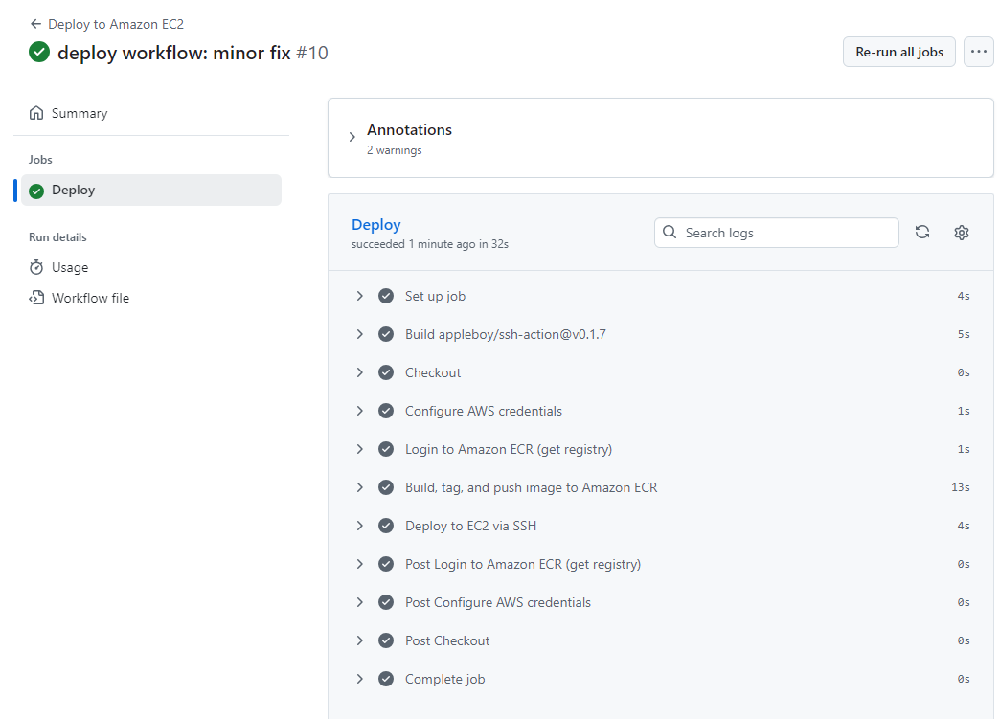
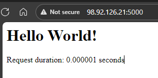
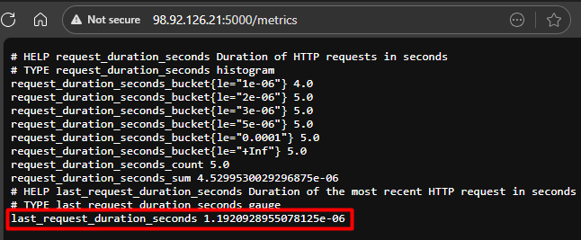
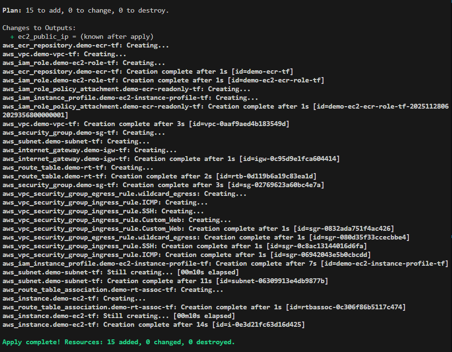

# Flask App with AWS Deployment Pipeline

> Automated cloud deployment demonstrating containerization, infrastructure as code, and CI/CD best practices.

## 🎯 What This Project Demonstrates

A Flask web application with **complete automation** from code to cloud:

- ✅ **Dockerized Flask app** with Prometheus metrics instrumentation
- ✅ **AWS infrastructure provisioned via Terraform** (VPC, EC2, ECR, IAM)
- ✅ **Automated CI/CD pipeline** using GitHub Actions
- ✅ **Monitoring** with Prometheus integration

## 🏗️ Architecture

```
GitHub Push → GitHub Actions → Build Docker Image → Push to ECR → Deploy to EC2
```

**AWS Resources Created:**
- VPC with public subnet and Internet Gateway
- EC2 instance (t3.micro) with Docker pre-installed
- ECR repository with image scanning enabled
- IAM roles and security groups

## 🚀 Quick Start

**Local Development:**
```bash
# With Docker
docker build -t nordhealth-app:latest .
docker run --rm -p 5000:5000 nordhealth-app:latest
```

**Deploy Infrastructure:**
```bash
cd aws-resources-terraform
terraform init
terraform apply
```

**Access:**
- App: http://localhost:5000/
- Metrics: http://localhost:5000/metrics

## 📊 Application Endpoints

- **`GET /`** - Hello World with request timing
- **`GET /metrics`** - Prometheus metrics (request duration histogram & gauge)

## 🔄 CI/CD Pipeline

GitHub Actions workflow automatically:
1. Builds Docker image on push to `main`
2. Pushes to AWS ECR with Git SHA tag
3. SSH into EC2 and deploys latest container



## 📸 Screenshots



*Application endpoint with request timing*




*Prometheus metrics endpoint*




*Infrastructure provisioned via Terraform*

## 🛠️ Tech Stack

**Application:** Python 3.12, Flask 3.1.2, prometheus_client  
**Containerization:** Docker, Docker Compose  
**Cloud & IaC:** AWS (EC2, ECR, VPC, IAM), Terraform  
**CI/CD:** GitHub Actions  

## 📦 Project Structure

```
├── main.py                      # Flask app with Prometheus metrics
├── Dockerfile                   # Alpine-based container image
├── .github/workflows/deploy.yml # CI/CD pipeline
└── aws-resources-terraform/     # Complete AWS infrastructure
    ├── main.tf
    ├── variables.tf
    └── outputs.tf
```

---

**Built as a demonstration of modern DevOps practices and cloud-native development.**
